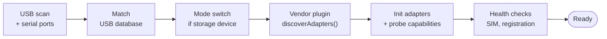
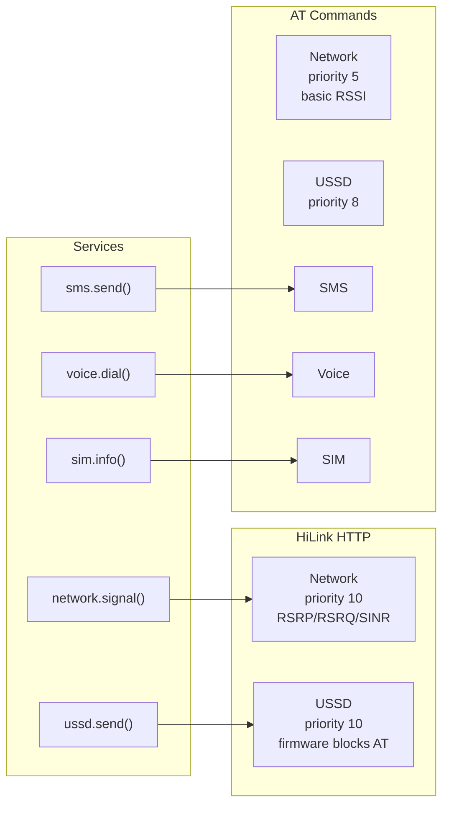

# cellary

Your SIM card as an API. Local hardware, developer experience.

> [!WARNING]
> **Work in progress — not ready for use.** cellary is under active, early
> development. APIs, CLI commands, wire formats, and behavior change frequently and
> without notice. Hardware support is partial and platform-dependent (some devices
> only work on Linux — see [Status](#status)). Expect rough edges and breakage. Not
> recommended for production, and no stability guarantees before 1.0.

Plug in any USB modem — cellary handles discovery, mode-switching, and protocol negotiation. You get a clean TypeScript API for SMS, voice calls, USSD, network monitoring, and SIM operations. No cloud dependency, no per-message fees, no AT command expertise required.

## Why

Cellular developer tooling has a gap. On one end: raw AT command libraries that require deep telecom expertise. On the other: cloud APIs (Twilio, Vonage) that abstract away hardware entirely — along with control, privacy, and cost.

In between: ModemManager (built for sysadmins, not developers), Gammu (stuck in the feature phone era), and a graveyard of abandoned npm packages that can barely send an SMS.

cellary is the missing option: **local hardware, developer experience**. Plug in a modem, call `modem.sms.send()`. Whether it speaks AT commands, Huawei HiLink HTTP, or something else — cellary figures it out.

| | cellary |
|---|---|
| **Twilio** | cloud, $0.0079/SMS, zero hardware control |
| **ModemManager** | DBus, sysadmin-oriented, no TypeScript API |
| **Gammu** | 2005-era, feature phones, no USB auto-detection |
| **serialport** | raw bytes — you write the AT protocol yourself |

## Install

```bash
pnpm add cellary
```

Requires Node.js 20+. USB auto-detection uses `libusb` (bundled via `usb`).

## Quick start

Plug in a modem and let cellary find it:

```ts
import { Modem } from 'cellary'

// Auto-detect: scans USB + serial, mode-switches if needed, runs health checks
const modem = await Modem.detect()

await modem.sms.send('+1234567890', 'Hello from cellary')

const signal = await modem.network.signal()
console.log(`${signal.rssi} dBm, ${signal.technology}`)

modem.on('sms:received', ({ storage, index }) => {
  console.log(`New SMS in ${storage} at index ${index}`)
})

await modem.close()
```

Or connect directly when you know the port:

```ts
const modem = await Modem.open('/dev/ttyUSB0')
```

## How it works

### Layers

```
                    CLI / GUI / your code
                           |
                       DeviceHandle
                           |
              +------------+------------+
              |                         |
        DirectBackend             RemoteBackend
        (USB/serial)              (daemon IPC)
              |                         |
           Modem                   DaemonClient
              |                         |
     +--------+--------+          Unix socket
     |        |        |               |
  AT serial  HTTP    ADB          cellaryd daemon
  (3GPP)    (vendor) (shell)          |
                                   Modem
```

Your code calls `modem.sms.send()`. The service router picks the best protocol adapter for that service. The adapter talks to the hardware over the appropriate transport. Multiple adapters can coexist -- an E8372 in HiLink+AT mode uses HiLink for signal (richer data) and AT for SMS and voice.

**Backend abstraction.** CLI commands depend on `DeviceHandle`, never on `Modem` or `DaemonClient` directly. When the daemon is running, everything goes through IPC (no sudo needed). When it's not, direct USB/serial access is used.

### Discovery: from plug-in to ready



`Modem.detect()` drives this entire pipeline. USB devices are matched against a built-in database. Storage-mode dongles are mode-switched to modem mode. Vendor plugins create the right protocol adapters. Health checks verify the modem is usable before returning it.

### Per-service protocol routing

Routing is per-service, not global. Each adapter declares priorities for the services it can provide. The router picks the highest-priority adapter for each call.



Real example: Huawei E8372 with both AT and HiLink active. HiLink wins for signal (provides RSRP/RSRQ/SINR that AT can't) and USSD (firmware blocks AT USSD when HiLink is active). AT wins for everything else — it's the only adapter that provides SMS, voice, SIM, STK, and capabilities.

### AT engine

The AtAdapter is built on a robust AT command engine:

```
Transport        SerialTransport | UsbTransport
     |
     | bytes
     v
AT Engine
  LineAssembler  ->  Parser  ->  ATChannel  (queue + state machine)
  URC dispatcher . command serialization . prompt flow . timeouts
     |
     v
Modules          sms . voice . network . sim . ussd . device . stk . capabilities
```

The engine handles the hardest parts of modem programming:

- **Command serialization** — one command in-flight at a time, FIFO queue for the rest
- **URC interleaving** — async notifications arriving mid-response are correctly separated
- **Ambiguity resolution** — `NO CARRIER` is a final result during `ATD` but a URC otherwise
- **Prompt flow** — SMS PDU data entry (`> ` prompt -> data -> Ctrl-Z)
- **Timeouts** — per-command, configurable per profile

### Connection resilience

When a modem connects, `AtAdapter.init()` probes the channel with a bare `AT` command (3 attempts with retry) before sending initialization commands. This catches devices that are still booting or have unstable USB connections.

If a USB device disconnects unexpectedly, the modem emits `'disconnect'` and attempts to reconnect automatically (configurable via `reconnect` option). On success, `'reconnect'` fires. If all retries fail, `'reconnect:failed'` fires.

```ts
const modem = await Modem.open('/dev/ttyUSB0', {
  reconnect: { delay: 2000, maxAttempts: 5 },
})

modem.on('disconnect', () => console.log('Lost connection'))
modem.on('reconnect', () => console.log('Back online'))
modem.on('reconnect:failed', () => console.log('Device gone'))
```

### Vendor plugins

Vendor plugins extend the base protocol with device-specific capabilities:

```ts
import { Modem, huaweiPlugin, DEFAULT_VENDORS } from 'cellary'

// Default: all built-in vendors included automatically
const modem = await Modem.detect()

// Or register custom vendors
const modem = await Modem.detect(undefined, {
  vendors: [...DEFAULT_VENDORS, myPlugin],
})
```

A plugin implements `VendorPlugin` and provides: protocol adapter discovery (e.g. HiLink HTTP alongside AT), vendor-specific URC decoding, call progress URC prefixes, device state resolution, and diagnostic probes.

Built-in vendors:

| Vendor | Plugin | Adapters | Hardware |
|--------|--------|----------|----------|
| Huawei | `huaweiPlugin` | AT + HiLink HTTP + ADB | E3372, E8372 |
| ZTE | `ztePlugin` | AT | MF656 |
| MSM8916 OEM | `msm8916OemPlugin` | AT + MiFi HTTP + ADB | UZ801, TianJie, UFI boards |

## CLI

```bash
cellary devices              # list connected modems (USB topology with --tree)
cellary info                 # device info, SIM state, signal
cellary signal               # signal strength with LTE metrics
cellary capabilities         # what this modem supports
cellary diagnose             # full device diagnostics
cellary sms list             # list stored messages
cellary sms send +N "text"   # send an SMS
cellary network scan         # scan available operators (30-120s)
cellary up                   # interactive TUI: live signal, calls, SMS, USSD
cellary watch                # watch USB bus for modem events
cellary init                 # initialize storage-mode devices (USB mode switch)
```

USB modems may need elevated privileges for direct USB access:

```bash
sudo cellary devices
```

### Daemon

The daemon (`cellaryd`) runs as a privileged system service that owns USB modem devices. When running, CLI commands work without sudo -- the daemon is the hardware gatekeeper, clients connect via Unix socket.

```bash
sudo cellary daemon install   # install as system service (launchd / systemd)
sudo cellary daemon start     # manual start
cellary daemon status         # check status (no sudo needed)
```

### up (monitor TUI)

`cellary up` is an interactive terminal UI for real-time modem interaction:

- Live signal bar and registration status
- Incoming call display with ring/setup/ringing/connected stages
- Event log: modem events (URCs, network changes), command results, decoded responses
- Commands: `sms <num> <text>` . `call <num>` . `answer` . `hangup` . `ussd <code>` . `quit`

## API

### Modules

| Module | Methods | Status |
|--------|---------|--------|
| **sms** | `send()`, `list()`, `read()`, `delete()`, `count()` | working |
| **voice** | `dial()`, `answer()`, `hangup()`, `dtmf()` | working |
| **network** | `signal()`, `registration()`, `operator()`, `scanNetworks()` | working |
| **sim** | `info()`, `imsi()`, `iccid()`, `enterPin()` | working |
| **ussd** | `send()`, `cancel()` | working |
| **device** | `info()`, `imei()` | working |
| **capabilities** | `discover()` | working |
| **stk** | proactive SIM commands (menus, input, display) | device-dependent |
| **traffic** | `session()`, `month()` | working (HiLink) |

### Events

```ts
modem.on('sms:received', ({ storage, index }) => { })
modem.on('call:ring', ({ number, direction, state }) => { })
modem.on('call:ended', (info) => { })
modem.on('network:registration', (info) => { })
modem.on('network:signal', (info) => { })
modem.on('urc', ({ prefix, body, raw }) => { })  // catch-all for unhandled URCs
modem.on('error', (err) => { })
modem.on('disconnect', () => { })
modem.on('reconnect', () => { })
modem.on('reconnect:failed', () => { })
modem.on('open', () => { })
modem.on('close', () => { })
```

## Advanced

### Capability discovery

```ts
const caps = await modem.capabilities.discover()
console.log(caps.sms.send)        // true/false
console.log(caps.voice.dial)      // true/false
console.log(caps.ussd.supported)  // true/false
console.log(caps.stk.supported)   // true/false
```

### Raw AT commands

```ts
const result = await modem.execute('AT+COPS?')
console.log(result.lines)   // ['+COPS: 0,0,"T-Mobile",7']
console.log(result.status)  // { type: 'ok' }
```

### Custom transport

```ts
import { Modem, MockTransport } from 'cellary'

const transport = new MockTransport()
const modem = await Modem.open({ path: '', transport })
```

### Modem profiles

cellary ships with a generic 3GPP profile that works with any standard modem. Vendor profiles (Huawei) are applied automatically by `Modem.detect()`. Custom profiles override init commands, URC prefixes, and timeouts:

```ts
const modem = await Modem.open('/dev/ttyUSB0', {
  profile: {
    name: 'Custom',
    initCommands: ['ATE0', 'AT+CMEE=1'],
    urcPrefixes: ['+CMTI', 'RING', '+CREG'],
    commandTimeouts: { 'AT+CMGS': 60_000 },
  },
})
```

### Fleet management

`ModemPool` manages multiple modems with automatic provisioning:

```ts
import { ModemPool } from 'cellary'

const pool = new ModemPool()
pool.start()

// Wait for the first modem to become ready
const modem = await pool.waitForReady()

// Or wait for a specific device
const huawei = await pool.waitForDevice('Huawei')

// React to device lifecycle
pool.on('modem:ready', (device, modem) => {
  console.log(`${device.name} ready`)
})

pool.on('device:readiness', (device) => {
  console.log(`${device.name}: ${device.readiness.stage}`)
})

await pool.stop()
```

Each device goes through a readiness pipeline: `detected` -> `assessing` -> `preparing` -> `connecting` -> `checking` -> `ready` (or `degraded` / `error`). The pool handles USB hot-plug, mode-switching, health checks, and cleanup automatically.

### Health checks and preparation

`Modem.detect()` runs health checks after connecting. The results are available on the modem:

```ts
const modem = await Modem.detect()
const report = modem.preparation
// report.verdict: 'ready' | 'degraded' | 'failed'
// report.steps: individual check results
// report.limitations: known device limitations
// report.recommendations: actionable suggestions
```

## Supported hardware

Any modem that speaks standard 3GPP AT commands works with the generic profile. USB plug-and-play (`Modem.detect()`) currently supports:

### Hardware tested

| Device | Connection | Notes |
|--------|-----------|-------|
| Huawei E3372h | USB direct (libusb) | proprietary CBW mode-switch |
| Huawei E8372H-153 | USB direct + HiLink HTTP | dual-mode: AT over USB, HTTP API for signal |
| TianJie U800-3 | RNDIS + HTTP | Qualcomm MSM8916 MiFi, HTTP management API |

### Testing roadmap

**Next — one per vendor:**

- [ ] ZTE MF656 — StandardEject mode-switch, shared storage PID
- [ ] Quectel EC25 — M.2/mPCIe, serial-only, no mode-switch
- [ ] SIMCom SIM7600 — RPi HAT, serial over USB

**Expand within vendors:**

- [ ] ZTE MF833V, Quectel EC200U, SIMCom SIM800L, u-blox SARA-R4

## Development

```bash
git clone https://github.com/lobotomoe/cellary
cd cellary
pnpm install
pnpm build       # ESM + CJS + declarations
pnpm test        # 826 tests via vitest
pnpm typecheck   # strict TypeScript
pnpm lint        # Biome + custom lint rules
```

Monorepo with three packages:
- `packages/core` (`cellary`) — library: modem, protocol adapters, discovery, fleet
- `packages/cli` (`@cellary/cli`) — interactive CLI with TUI
- `packages/daemon` (`@cellary/daemon`) — privileged USB daemon, IPC server

## Status

The core engine is solid and comprehensively tested (826 tests). USB plug-and-play discovery, mode-switching, and serial port detection all work. The CLI covers the main use cases with an interactive monitor TUI. Three vendor plugins: Huawei (AT + HiLink HTTP + ADB), ZTE (AT), and MSM8916 OEM (AT + MiFi HTTP + ADB). Fleet management with automatic provisioning is available. The daemon runs as a system service (launchd/systemd), providing unprivileged access via IPC. Backend abstraction lets CLI commands work transparently through the daemon or direct USB.

Active development — breaking changes may occur before 1.0.

## License

MIT
